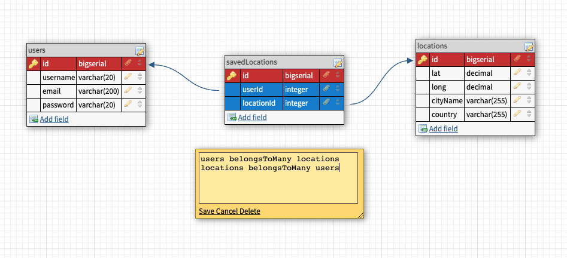
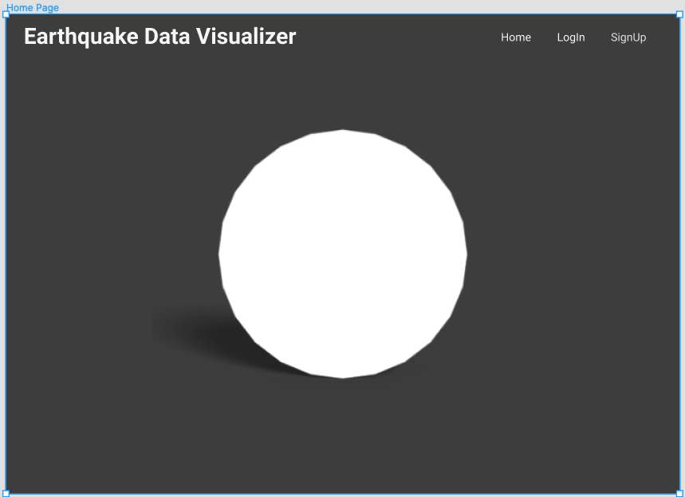
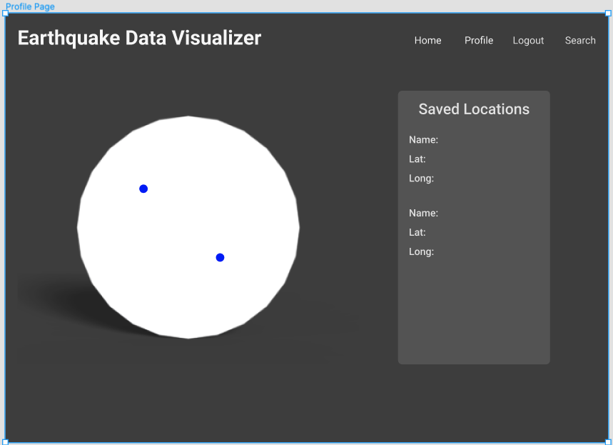
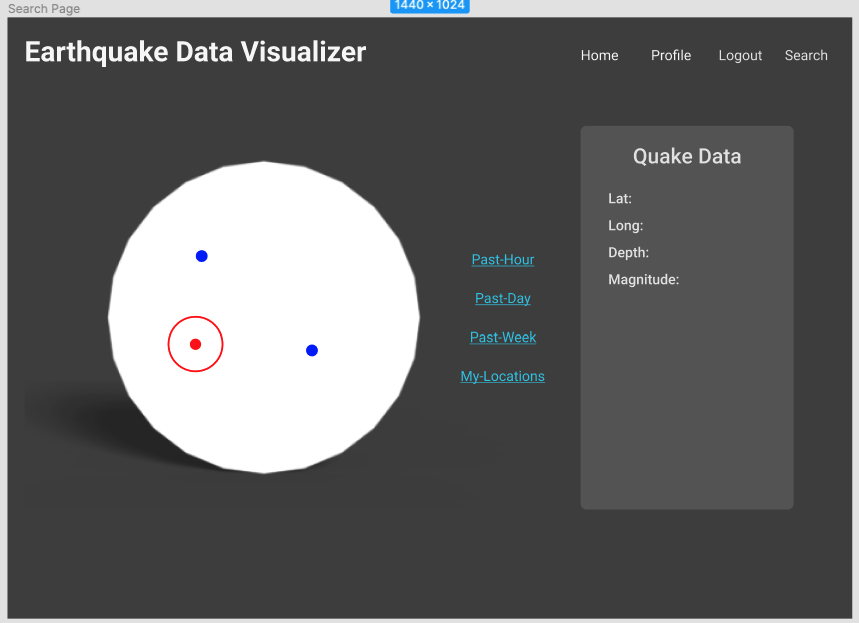

# Earthquake-Data-FE

## OVERVIEW
> Web application that connects to the USGS Earthquake Catalog. The user will be able to look up earthquake data based on different time-frames or locations.
> I am building this app to practice full-stack developement, user authorization, 3rd party API's, and play with Three.js!
## WIREFRAMES

- Home Page: Shows globe animated to spin and example quakes animations.

- Profile Page: Shows user saved locations in a table, and on the animated globe.

- Search Page: Allows the user to make several searchs and shows results in a table, and on the animated globe.

## USER STORIES
- When the user logs on, they see a globe with their location on it.
- The user can navigate to the search page where they can search for earthquakes by time-frame. (hr, day, week)
- When a search is made, the resulting data is diplayed on a globe showing the location(s) and magnitude(s) of the resulting quake(s).

## ROUTES
- POST /user/new
- POST /user/login
- POST /user/update
- DELETE /user/bye-bye
- GET /users/verify
- GET /quakes/past-hour
- GET /quakes/past-day
- GET /quakes/past-week
- GET /quakes/by-location

## API ENDPOINT's
- https://earthquake.usgs.gov/earthquakes/feed/v1.0/geojson.php
- https://earthquake.usgs.gov/earthquakes/feed/v1.0/summary/all_hour.geojson
- https://earthquake.usgs.gov/earthquakes/feed/v1.0/summary/all_day.geojson
- https://earthquake.usgs.gov/earthquakes/feed/v1.0/summary/all_week.geojson
## MVP
- CRUD users
- GET requests to USGS database
    - display returned data in a table
- Seed locations with cities around the globe
- User can save a location from the list
    - User can add a new city to locations
- User security through encryptedId
- UserId middleware
## STRETCH
- Display returned data on the globe
- Animate globe
- Animate quakes
- Focus globe view on a specific quake

## REFERENCES
- https://jsfiddle.net/neeh/4n9ymu2c/63/
- https://blog.mastermaps.com/2013/09/creating-webgl-earth-with-threejs.html
- https://timcchang.com/threejs-globe#drawing-a-mercator-projection-using-dots
- https://github.com/mrdoob/three.js/blob/master/examples/webgl_buffergeometry_points.html
